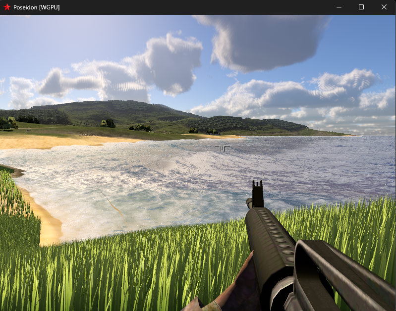
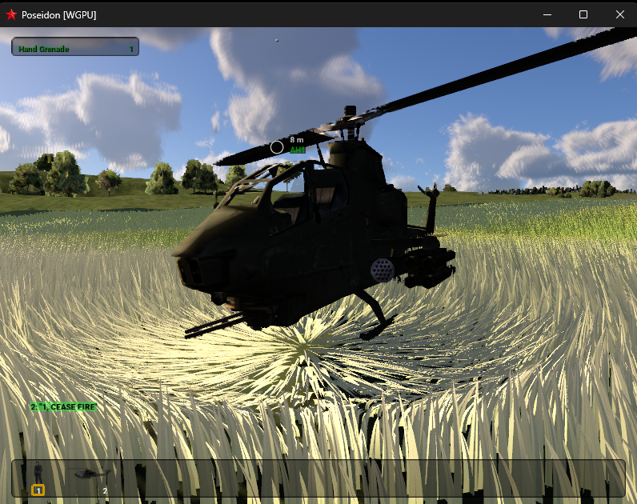

# PoseidonWGPU

[](https://github.com/sponsors/koosoli)
[](https://buymeacoffee.com/koosoli)

**PoseidonWGPU** is a modernization-focused fork of the classic Poseidon engine
behind *Arma: Cold War Assault* / *Operation Flashpoint: Cold War Crisis*.
Its goal is simple: make this landmark 2001 game feel as modern as possible
while preserving compatibility with the original assets, data formats, missions,
and gameplay.

> This is an independent community project and is not an official Bohemia
> Interactive product.

## Current preview





## What PoseidonWGPU adds

PoseidonWGPU develops a modern [wgpu](https://wgpu.rs/)-based renderer alongside
the legacy OpenGL renderer. The current work focuses on practical visual upgrades
that still let the original game content remain at the centre of the experience:

- Procedural terrain grass with live wind, player and vehicle impressions,
  helicopter rotor wash, and explosive-impact bending.
- A GPU-driven water system with FFT ocean simulation, shoreline behaviour,
  reflections, foam, and projectile/explosion interactions.
- Consolidated work from another [paavohuhtala/CWR-CE](https://github.com/paavohuhtala/CWR-CE)
  branch, including its volumetric cloud system.
- A procedural sky where the clouds cast shadows on the ground: terrain, objects,
  grass and water all read the same sun-transmittance map, so a passing deck dims
  the scene together rather than only the ground. Nights have stars (no moon yet).
- Screen-space ambient occlusion (GTAO): scalar occlusion plus a bent-normal
  directional ambient term and a hierarchical depth-mip march, on by default with
  its own developer tab and debug views. Its cost scales with pixel count, so it
  is worth turning down before anything else on a high-resolution display.
- A modern, observable rendering path with GPU timing and developer diagnostics
  for testing and iteration.
- Zeus mode in the developer tools: a Game Master-style free-fly camera with
  altitude-scaled movement, Shift speed boost, inverted mouse look, and
  click-to-place unit and vehicle spawning.

The project is deliberately evolutionary rather than a replacement engine:
existing game data and the established CWR-CE codebase remain the foundation.

## Project lineage

PoseidonWGPU is a fork of [paavohuhtala/CWR-CE](https://github.com/paavohuhtala/CWR-CE),
which is itself a fork of [ofpisnotdead-com/CWR-CE](https://github.com/ofpisnotdead-com/CWR-CE).
That community project continues Bohemia Interactive's official source release of
the original Poseidon engine. This fork builds on the work of all of those
projects and the Operation Flashpoint / Arma community that has kept the game
alive for more than two decades.

## Support the project

Much of this work involves long-running renderer development, testing on legacy
assets, and AI-assisted code exploration. If you would like to support the work,
funds go toward API usage and direct development costs for PoseidonWGPU.

Use the GitHub Sponsors or Buy Me a Coffee buttons above to support the project.

## Quick start

### Requirements

- [Clang](https://clang.llvm.org/)
- [CMake](https://cmake.org/)
- [Ninja](https://ninja-build.org/)
- [vcpkg](https://vcpkg.io/)

On Windows:

```powershell
winget install Kitware.CMake LLVM.LLVM Ninja-build.Ninja
```

Then install and configure vcpkg following the
[official guide](https://learn.microsoft.com/en-us/vcpkg/get_started/get-started?pivots=shell-powershell).

Windows also needs the Windows SDK's `mt.exe` on `PATH`. Configuring from a
plain shell without it fails at the compiler check with `CMAKE_MT-NOTFOUND`,
which reads like a broken toolchain rather than a missing tool. Either build
from a Developer PowerShell, or add the SDK's bin directory yourself:

```powershell
$env:PATH = "C:\Program Files (x86)\Windows Kits\10\bin\<sdk-version>\x64;" + $env:PATH
```

An existing `build/` directory hides this, because the cache already recorded
`mt.exe` — so the failure only shows up on a fresh clone.

### Build

```powershell
cmake --preset win-x64-clang-rwdi
cmake --build build/win-x64-clang-rwdi --target PoseidonGame
```

For Linux, use the matching `linux-x64-clang-rwdi` preset.

### Run with the WGPU renderer

Copy both the executable and `wgpu_renderer.dll` from the build output to a local
game installation, then launch from that installation directory:

```powershell
.\ColdWarAssault.exe --render wgpu --window --dev
```

Both binaries must come from the same build. Game data is separate from this
repository; the free
[*Arma: Cold War Assault Remastered* Demo](https://store.steampowered.com/app/4819000/Arma_Cold_War_Assault_Remastered_Demo/)
is suitable for local testing.

## Repository layout

- [apps](apps/README.md) — executable targets
- [engine](engine/README.md) — engine libraries and rendering backends
- [mserver](mserver/README.md) — master-server tools
- [tests](tests/README.md) — test source trees
- `cmake/` — presets, toolchains, and vcpkg configuration
- `resources/` — application resources
- `thirdparty/` — vendored third-party sources and headers

## Source, brand, and game data

The source code in this repository is licensed under the
[GNU GPL v3.0 or later](LICENSE), with additional terms under Section 7.

`ARMA`, `Operation Flashpoint`, their logos, and related marks are not granted by
this repository and remain the property of their respective owners. Models,
textures, sounds, missions, voices, and other game data are separate from this
repository and are distributed under the
[Arma Public License Share Alike](https://www.bohemia.net/community/licenses/arma-public-license-share-alike).

See [CREDITS.md](CREDITS.md), [CONTRIBUTING.md](CONTRIBUTING.md), and
[THIRD_PARTY_NOTICES.md](THIRD_PARTY_NOTICES.md) for more information.
